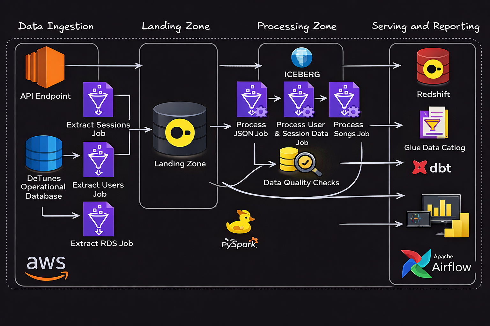

# Music Data Platform: End-to-End AWS Data Engineering Pipeline

An end-to-end data engineering project that ingests music activity data, transforms it into analytics-ready datasets, validates data quality, and serves modeled outputs for dashboarding.

This project demonstrates production-style practices across orchestration, transformation, warehouse modeling, and infrastructure-as-code.



---

## Executive Summary

- Built an orchestrated pipeline across ingestion, transformation, quality checks, and serving.
- Modeled data for analytics using dbt + Redshift.
- Automated infrastructure provisioning with Terraform.
- Implemented Glue-based extraction/transformation and Airflow DAG orchestration.

If you only review a few files, start here:

1. `data_quality_and_orchestration/dags/deftunes_api_pipeline.py`
2. `data_quality_and_orchestration/dags/deftunes_songs_pipeline.py`
3. `data_quality_and_orchestration/terraform/main.tf`
4. `data_quality_and_orchestration/dbt_modeling/models/serving_layer/fact_session.sql`
5. `data_quality_and_orchestration/dbt_modeling/models/bi_views/sales_per_artist_vw.sql`

---

## Problem and Context

Operational music data arrives from multiple sources:

- API endpoints for users and sessions
- PostgreSQL (RDS) for songs

Raw source formats are not directly suitable for analytics. This project standardizes those datasets into curated tables, enforces quality checks, and publishes serving models for BI.

---

## Tech Stack

- Orchestration: Apache Airflow
- Processing: AWS Glue (Spark)
- Data Lake: Amazon S3 (landing + transformation zones)
- Table Format: Apache Iceberg
- Metadata: AWS Glue Data Catalog
- Warehouse: Amazon Redshift (+ Spectrum)
- Modeling: dbt
- Infrastructure: Terraform
- Language: Python, SQL

---

## Pipeline Flow (Aligned to the Diagram)

1. Source layer
- API endpoint provides users and sessions payloads.
- DeFtunes PostgreSQL database provides songs data.

2. Extraction layer (Landing Zone)
- `Extract Users job` and `Extract Sessions job` ingest API data into S3 landing paths.
- `Extract RDS job` ingests songs records into S3 landing paths.

3. Transformation layer (Transformation Zone)
- `Transform JSON job` normalizes users/sessions structures.
- `Transform Songs job` cleans and casts songs schema.
- Outputs are written as Iceberg tables in S3.

4. Data quality layer
- Glue Data Quality rulesets validate critical fields and constraints before downstream serving.

5. Catalog and query layer
- Glue Data Catalog registers transformed datasets.
- Redshift Spectrum reads external transformed tables.

6. Serving layer
- dbt builds serving tables/views in Redshift for analytics consumption.

7. Consumption layer
- Dashboard queries run against Redshift serving models.

8. Control plane
- Airflow coordinates all task dependencies end-to-end.

---

## Repository Structure

```text
.
|-- data_quality_and_orchestration/
|   |-- dags/                  # Airflow DAGs
|   |-- dbt_modeling/          # dbt serving models + BI views
|   |-- terraform/             # IaC for extract/transform/quality/serving
|   `-- scripts/               # Setup and operational helper scripts
|-- etl_&_data_modeling/
|   |-- dbt_modeling/          # ETL-stage dbt assets
|   |-- terraform/             # ETL-stage IaC and Glue assets
|   `-- scripts/               # ETL-stage setup helpers
|-- tests/                     # Python tests (DAG integrity)
`-- .github/workflows/         # CI checks
```

---

## Core DAGs

- `deftunes_api_pipeline_dag`
  - Extract users and sessions from API
  - Transform JSON datasets
  - Run users/sessions data quality checks
  - Run dbt in Docker

- `deftunes_songs_pipeline_dag`
  - Extract songs from RDS
  - Transform songs dataset
  - Run songs data quality check
  - Run dbt in Docker

---

## Local Setup

1. Install dependencies

```bash
python -m pip install --upgrade pip
python -m pip install -r requirements.txt
```

2. Configure environment variables

```bash
cp .env.example .env
cp profiles.yml.example ~/.dbt/profiles.yml
```

3. Run validation

```bash
make lint
make test
```

---

## Infrastructure Deployment

```bash
cd "etl_&_data_modeling/terraform"
terraform init
terraform plan
terraform apply

cd "../../data_quality_and_orchestration/terraform"
terraform init
terraform plan
terraform apply
```

---

## Data Engineering Skills Demonstrated

- Pipeline orchestration with Apache Airflow DAG dependency design and task sequencing
- Batch ingestion from heterogeneous sources (API + PostgreSQL) into S3 landing zones
- Distributed transformation using AWS Glue (Spark) for schema standardization and enrichment
- Lakehouse table handling with Apache Iceberg and Glue Data Catalog integration
- Data quality implementation using AWS Glue Data Quality rulesets as pipeline gates
- Dimensional serving model development with dbt on Redshift
- Infrastructure-as-code design with Terraform modules for repeatable environment provisioning
- Environment-driven configuration and operational scripting for deployment workflows
- CI-oriented engineering practices with repository lint/test/format checks